# Point of Sale (POS) - Inventory & Super Shop Management System - C#

<div align="center">
  
  
  &nbsp;
  &nbsp;
  &nbsp;

</div>


# Quick Shortcuts

[**1. Get Started**](#point-of-sale-pos)
-
  - [Roles](#roles)
  - [Features](#features)


 [**2. Quick Overview - Setup & Run**](#quick-overview---setup--run)
-
- [Step - 1](#step---1)
- [Step - 2](#step---2)
- [Step - 3](#step---3)
- [Step - 4](#step---4)

  
 [**3. Tools & Technologies**](#tools-technologies)
 -

   - [Languages](#languages)
   - [IDE](#ide)
   - [Database](#database)
   - [Icons](#icons)
  
 [**4. Solution Explorer & Layer Architecture**](#solution-explorer--layer-architecture)
 -
 - [Solution Explorer](#solution-explorer--layer-architecture)
   - [Layer Architecture](#solution)
      - [**1. Application Layer**](#1-application-layer)
      - [**2. DataAccess Layer**](#2-dataaccess-layer)
      - [**3. Entity Layer**](#3-entity-layer)
      - [**4. Framework Layer**](#4-framework-layer)
      - [**5. Repository Layer**](#5-repository-layer)
  
  [**5. Database Diagram**](#database-diagram)
  -
  - [Diagram Image](#database-diagram)

  [**6. Screens**](#screens)
  -
  - [Windows Forms](#windows-forms)
    - [**# Login**](#-login)
    - [**# Dashboard**](#-dashboard)
    - [**# Make Payment**](#-make-payment)
    - [**# Sales History**](#-sales-history)
    - [**# Master Categories**](#-master-categories)
    - [**# Main Category**](#-main-category)
    - [**# Second Category**](#-second-category)
    - [**# Third Category**](#-third-category)
    - [**# Vendors**](#-vendors)
    - [**# Brands**](#-brands)
    - [**# Products**](#-products)
    - [**# Expenses Tracker**](#-expenses-tracker)
    - [**# Employees & User Tracker**](#-employees--user-tracker)
    - [**# Database Backup & Restore**](#-database-backup--restore)
  
 [**7. Note**](#note)
-

# Point of Sale (POS)

Point of Sale (POS) with N-Tier Architecture ([**5 Layers**](#solution)). This Project was developed in C# and follows Object Relational Mapping (ORM) from scratch and using MS SQL Server 2019 and .NET Framework 4.8 as backend. Project-based on my university course curriculum [CSC 2210: Object Oriented Programming 2](https://www.aiub.edu/faculties/fst/ug-course-catalog).
<br>

#### This POS has **3 Roles** features. 

## # Roles

- User 1 : **Admin**
- User 2 : **Cashier**  
- User 3 : **Salesman**

## # Features

> ### **1. Admin**
- Manage Employees – Add Employee, Delete Employee, Edit Employee Info.
- Manage Products – Add Product, Delete Product, Edit Product Info.
- Manage Stock – Add, Delete, Edit - Vendor’s Product.
- Salary History Tracking.
- Expenses & Liabilities Tracking.
- Make Sell.
- Bill Generate.
- Selling History.
- Database Backup & Restore.
  
<br>

> ### **2. Cashier**
- Make Sell.
- Bill Generate.
- Selling History.
- Manage Stock.

<br>

> ### **3. Salesman**
- Make Sell.
- Bill Generate.

<hr>

## Quick Overview - Setup & Run

>**Need to Download**:<br>[Visual Studio 2019](https://visualstudio.microsoft.com/downloads/)
<br>[.NET Framework 4.8](https://dotnet.microsoft.com/download/dotnet-framework/net48)
<br>[Microsoft SQL Server 2019 *Express (64-bit)*](https://www.microsoft.com/en-us/sql-server/sql-server-downloads)
<br>[SQL Server Management Studio (SSMS) 18.9.2](https://docs.microsoft.com/en-us/sql/ssms/download-sql-server-management-studio-ssms?view=sql-server-ver15) 

#### Step - 1 
Download or Clone
```sh
git clone https://github.com/livealvi/.NET-Point-of-Sale-POS--Csharp
```

#### Step - 2
Make [Database](#database) follow this [Diagram](#database-diagram)

#### Step - 3
Make Database connection on [**DataAccess Layer**](#2-dataaccess-layer)

#### Step - 4
Goto project folder **PointOfSaleProject** open 
```POS.InventoryManagementSystem.sln``` with  ```Visual Studio```

#### Step - 3
Build & Run the project

<hr>


# Tools & Technologies

## Languages

 - C# Language Basics
 - [.NET Framework 4.8](https://dotnet.microsoft.com/download/dotnet-framework/net48)

## IDE

- [Visual Studio 2019](https://visualstudio.microsoft.com/downloads/)

## Database

 - [Microsoft SQL Server 2019 *Express (64-bit)*](https://www.microsoft.com/en-us/sql-server/sql-server-downloads)
 - [SQL Server Management Studio (SSMS) 18.9.2](https://docs.microsoft.com/en-us/sql/ssms/download-sql-server-management-studio-ssms?view=sql-server-ver15) 

## Icons 
- [Icons8 - Pichon](https://icons8.com/app/windows)

# Solution Explorer & Layer Architecture

> Using **5 layers**

### **Solution**

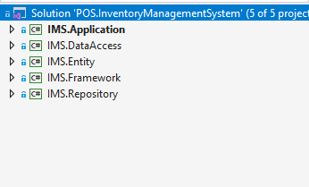 

#### **1. Application Layer**

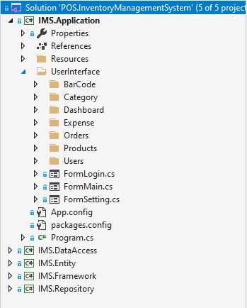 

#### **2. DataAccess Layer**
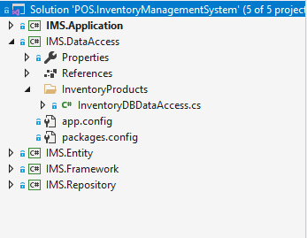

#### **3. Entity Layer**

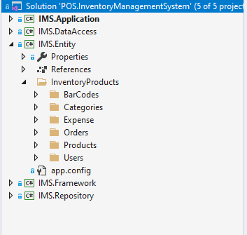

#### **4. Framework Layer**

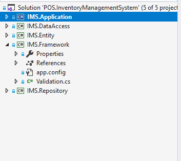

####  **5. Repository Layer**

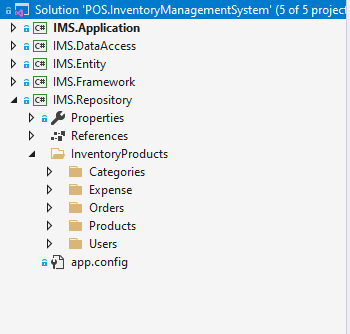

# Database Diagram 
> **Note:** Using SQL Server & SQL Server Management Studio (SSMS)<br>(_**Database Script or .bak file Not Include on this repo**_)

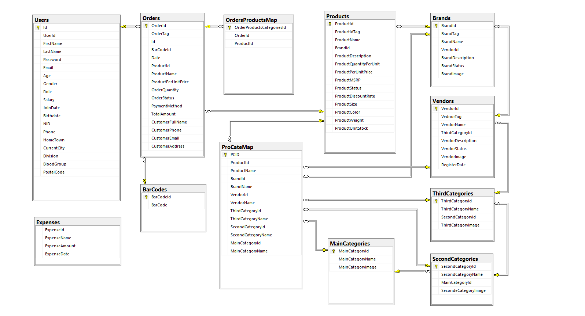


# Screens

## Windows Forms
> **Note:** Using Default .NET UI Component And **Two 3rd Party** .NET UI & Reporting Components<br>(_**3rd Party UI Not Include on this repo**_) <br>
 >  - [DevExpress](https://www.devexpress.com/)
 >  -  [Guna UI2](https://gunaui.com/)

### **# Login**
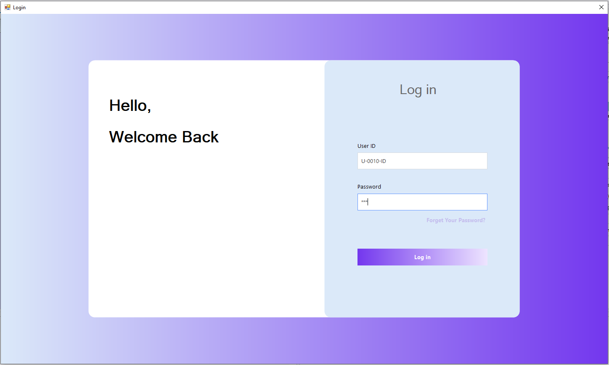

### **# Dashboard**

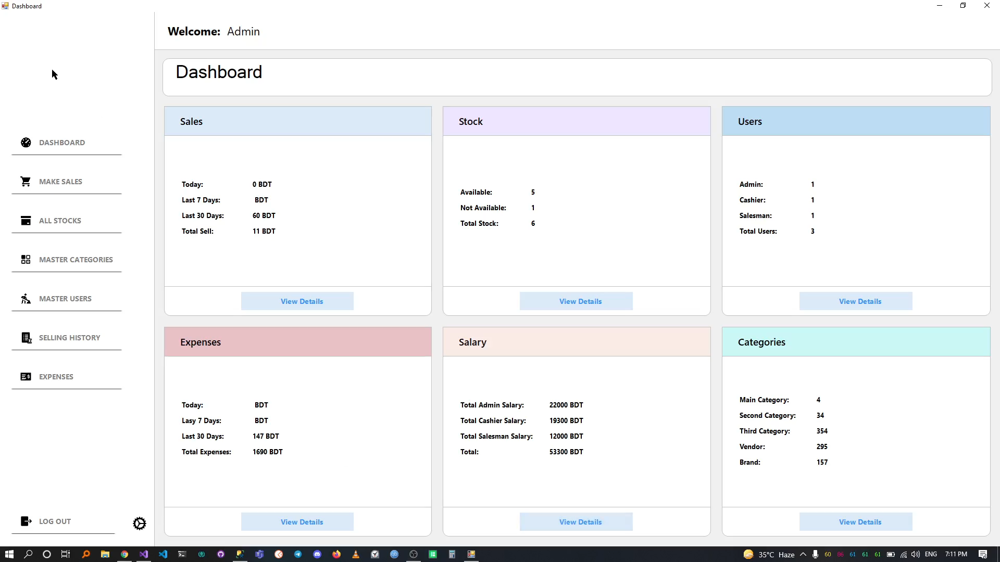

### **# Make Payment**

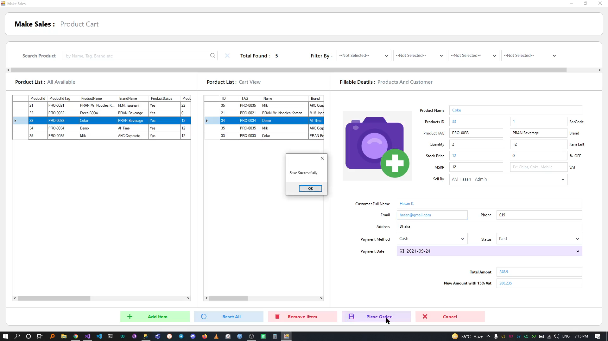

### **# Sales History**


### **# Master Categories**


### **# Main Category**

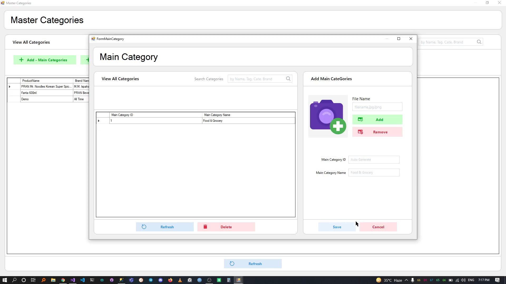

### **# Second Category**

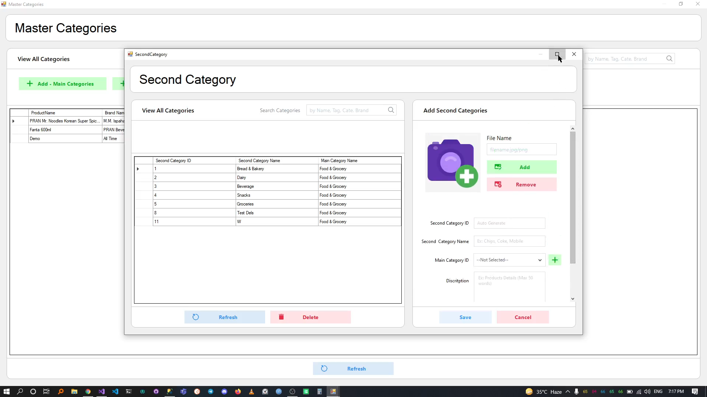

### **# Third Category**

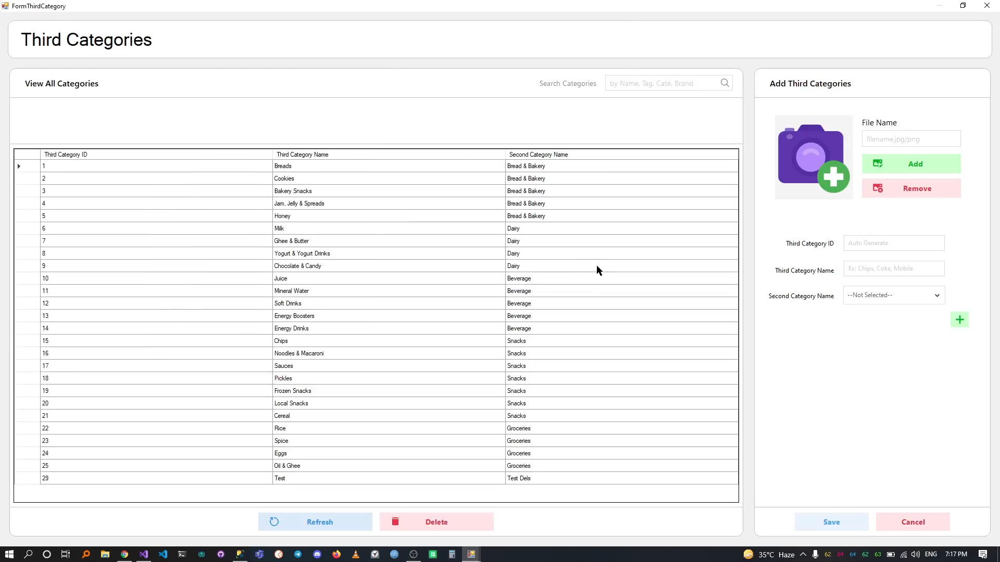

### **# Vendors**

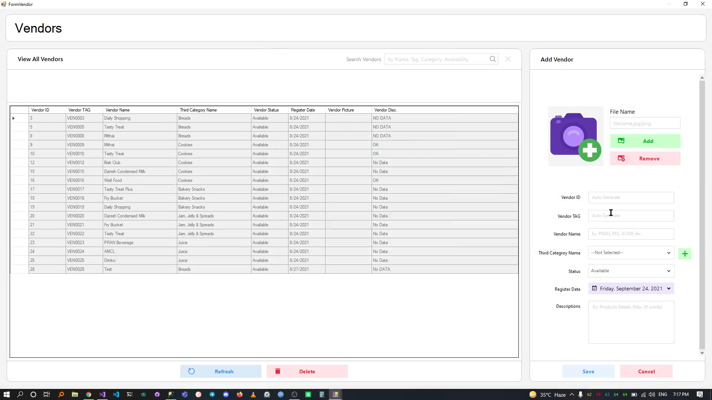

### **# Brands**

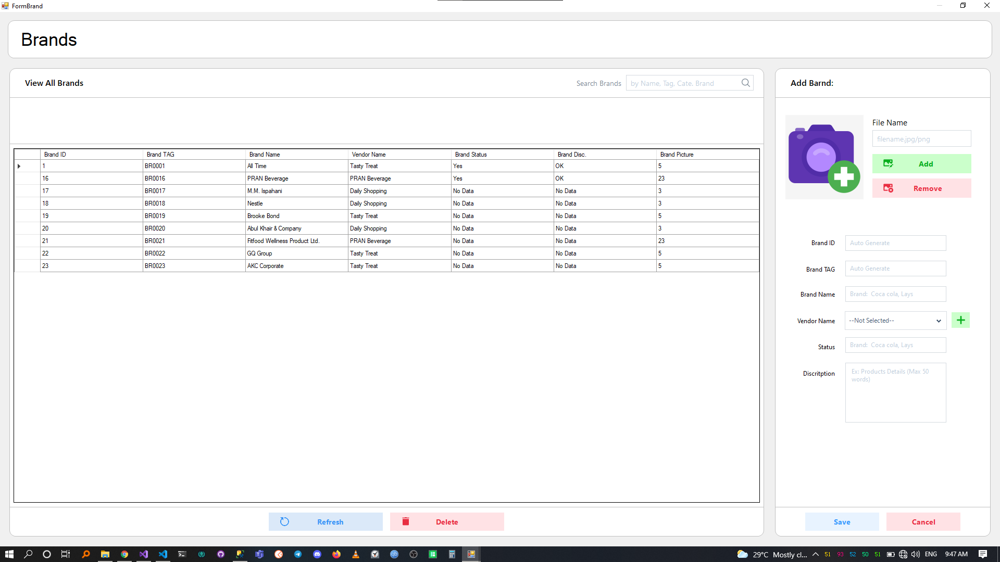

### **# Products**

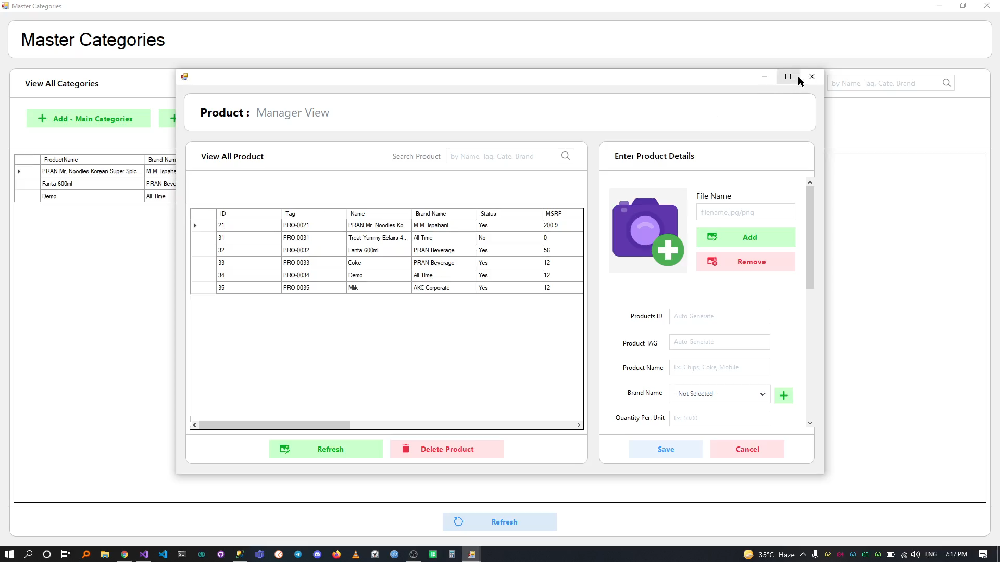

### **# Employees & User Tracker**

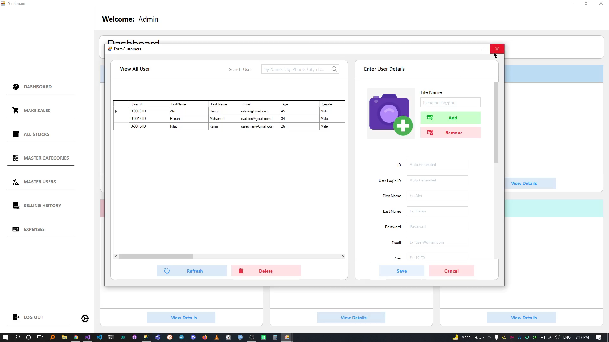

### **# Expenses Tracker**

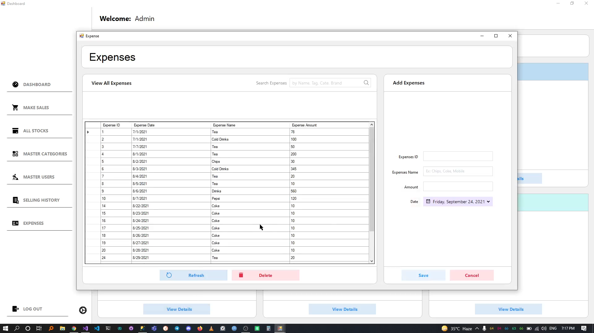

### **# Database Backup & Restore**

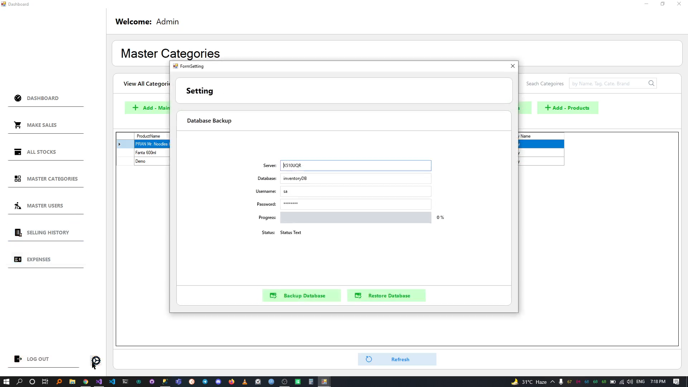

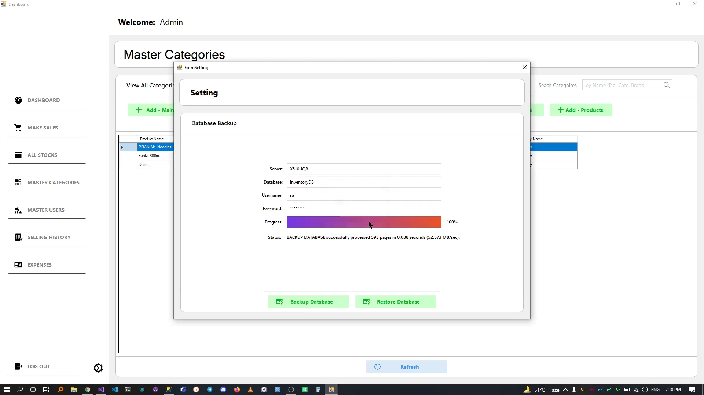

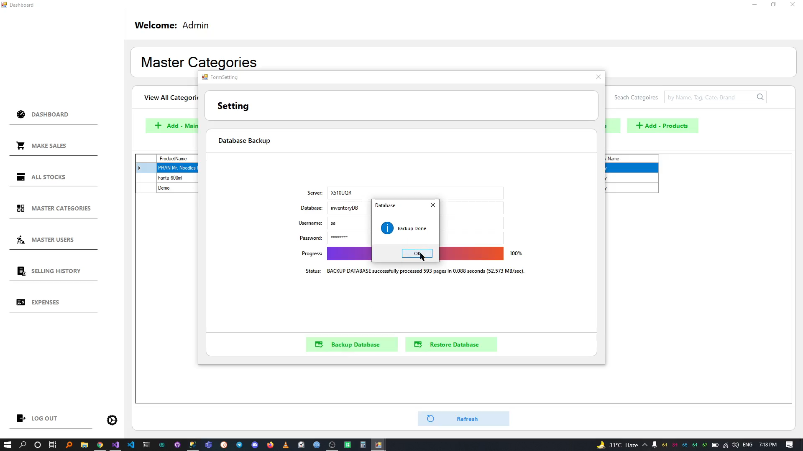

## Note

- Backup Microsoft SQL Database Script or .bak file  Not Include
  <br>
- 3rd Party .NET UI & Reporting Components Not Include [DevExpress](https://www.devexpress.com/) and [Guna UI2](https://gunaui.com/) Not Include

### - Thank You.


